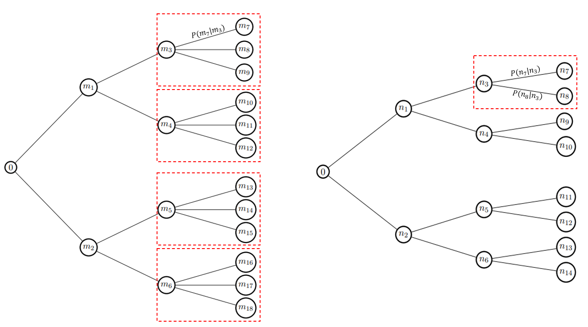

<h1 align="center">🌳 Nested Tree Reduction via Optimal Transport</h1>

<p align="center"><em>
A fast, modular, and production-ready implementation of scenario tree reduction based on the nested distance and Wasserstein barycenters.
</em></p>

<p align="center">
  
  
  
  
  
  
</p>

---

## 📘 Overview

This repository implements a new, efficient method for scenario tree reduction based on the **nested distance**, inspired by the article:

> **"A scalable method for stochastic process approximation using Wasserstein barycenters"**  
> Daniel Mimouni, 2024 — [📄 PDF](https://dan-mim.github.io/files/reduction_tree.pdf)

The method is designed for practical use in stochastic decision-making under uncertainty, and is already used by **IFP Energies Nouvelles (IFPEN)** for **energy decision management** applications.

---

## 🚀 Key Contributions

- ✅ This repository implements a **boosted version** of the classical **Kovacevic–Pichler scenario tree reduction** method:  
  > Kovacevic, R.M., & Pichler, A. (2015). *Tree approximation for discrete time stochastic processes: a process distance approach*,  
  > *Annals of Operations Research*, 235(1), 395–421.

  The core innovation introduced in [Mimouni et al. (2024)](https://dan-mim.github.io/files/reduction_tree.pdf) is the identification that each subtree reduction step is equivalent to solving an **optimal transport barycenter problem** — a viewpoint that was previously overlooked.

- ⚡ Leveraging this insight, the algorithm integrates **state-of-the-art Wasserstein barycenter solvers** to drastically accelerate the reduction process:
  - **IBP (Sinkhorn)**: entropic regularization method ([see more here](https://github.com/dan-mim/Wasserstein-barycenters))
  - **MAM (Method of Averaged Marginals)**: exact projection method based on Douglas–Rachford splitting (introduced by Mimouni et al. in 2024 - [see more here](https://github.com/dan-mim/Computing-Wasserstein-Barycenters-MAM))

- 🧱 The result is a **production-ready library** that combines theoretical guarantees with computational efficiency — currently deployed at **IFPEN** for real-world energy management problems under uncertainty.


- 🧠 Insight: the **reduction of a scenario tree** can be expressed as a **succession of Wasserstein barycenter problems**.  
  At each stage, an optimal subtree corresponds to the **barycenter of original subtrees**, weighted by their probability.

<p align="center">
  
</p>

---
## 🔍 Scenario Preselection with Fast Forward Selection

To further enhance scalability, we provide a **Fast Forward Selection** preprocessing routine that reduces the number of scenarios in the original tree **based on the Wasserstein distance**.  
This heuristic selects the most representative scenarios from a large sample set, ensuring that the retained scenarios maintain maximal distributional coverage.

This selected subset can then be used as a **starting point** for the main reduction algorithm.

⚠️ **Important Note**:  
The `reduction_tree` method requires a pre-defined **tree structure** (i.e., a filtration with fixed branching), which it does not alter. It adjusts the **probabilities and values** within this structure to minimize the **Nested Distance** to the original process.

Thus, **Fast Forward Selection** is an effective tool to first simplify the size of the scenario space (using Wasserstein metrics), while the core algorithm (`pyreductree`) performs the **refined reduction** in terms of nested distance — preserving temporal dependencies and stage-wise uncertainty.

---

## 📦 Package Structure

The core implementation is organized in the `pyreductree` package:

```
pyreductree/
├── __init__.py                 # Package interface
├── core.py                     # Main reduction logic (recursive & iterative)
├── barycenters.py              # MAM and IBP solvers for barycenter computation
├── cost_functions.py           # Wasserstein metrics and scenario cost matrices
├── io.py                       # Load/save tree data, formats, and datasets
├── metrics.py                  # Nested distance computation
├── utils.py                    # Tree manipulation, flattening, logging
```

Additionally:
- `examples/`: Demonstrations and real-world instances
- `figs/`: Visual outputs and benchmark figures

Note that the parallelization is computed using **MPI** (`mpi4py`) for large-scale use
---

## 🔧 Installation

```bash
git clone https://github.com/dan-mim/Nested_tree_reduction.git
cd Nested_tree_reduction
conda create -n treereduct python=3.10
conda activate treereduct
pip install -r requirements.txt
conda install -c conda-forge mpi4py  # if you want to run the MPI version
```

---

## 📈 Applications

This method has been successfully applied in:
- ⚡ **Energy system design** (used by IFPEN)
- 📉 **Stochastic optimization problems**
- 🏭 **Industry-grade scenario compression**
- 🎯 Any process requiring fast and controlled tree reduction under **probability distribution distance metrics**

<p align="center">
  
  
</p>

---

## 🧠 Reference

If you use this project in your research or applications, please cite:

```
@article{mimouni2024nested,
  title={A scalable method for stochastic process approximation using Wasserstein barycenters},
  author={Mimouni, Daniel},
  year={2024},
  journal={Preprint},
  url={https://dan-mim.github.io/files/reduction_tree.pdf}
}
```

And the original method:

```
@article{kovacevic2015tree,
  title={Tree approximation for discrete time stochastic processes: a process distance approach},
  author={Kovacevic, R.M. and Pichler, A.},
  journal={Annals of Operations Research},
  volume={235},
  number={1},
  pages={395--421},
  year={2015}
}
```

---

## 📜 License

MIT © 2024 — Daniel Mimouni

---